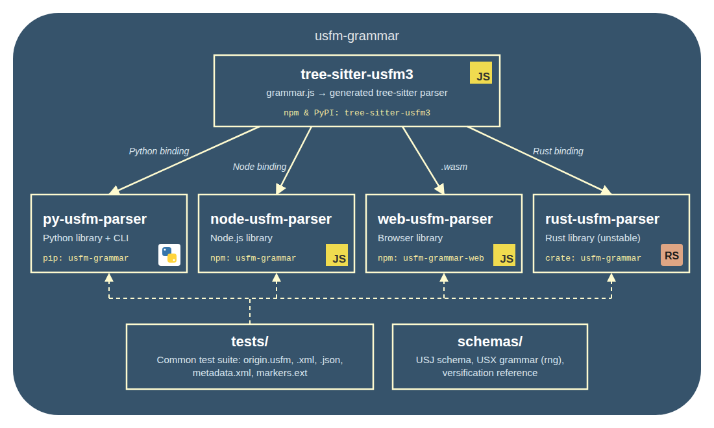

# Usfm-grammar Version 3
## Architecture

This document describes the high-level architecture of usfm-grammar. This is intended to guide you to familiarize yourself with the code base.

## Bird's Eye View

Usfm-grammar is a grammar implementation, modelling the [USFM](https://docs.usfm.bible/usfm/3.1.2/index.html) markup language, popularly used to represent the scripture(Bible) and meta-scripturual contents. It also include parsers and editor-plugins built on top on this grammar to be able to convert USFM to other formats like USJ(JSON), CSV, USX(XML counter part of USFM) etc or be able to do syntax highlighting, code folding etc on editors.

Implemented Using
* Tree-sitter
* Python
* Javascript: node and web

[Tree-sitter](https://tree-sitter.github.io/tree-sitter/) is a parser generator. We model the USFM language in the Context-Free-Grammar, as required by it, and it can build parsers that can create syntax tree for a source USFM file. 




## Code Map

This section talks briefly about various important directories and files. It would give you ideas on where to find things you are looking for, in the code base.


### usfm-grammar/tree-sitter-usfm3

This module contain the grammar. Here we define and generate the grammar to be used by other modules and tools.
This module is published individually as `tree-sitter-usfm3` on npm and PyPI, which provide the node and python bindings of the grammar used by the parser modules.

**grammar.js**: The file where we model the USFM language. Here we define the tokens, synatx rules and the structure of the output syntax-tree(AST).

**test/corpus**: This contain the test cases. The test files start with `test` and should contain input USFM and expected AST. 

**queries/**: The queries on syntax tree and mapping of components to themes, for syntax highlighting.

**package.json**: The details of this module, like, its dependancies, version, etc

Useful commands while working in this module:
```
cd ./tree-sitter-usfm3
export PATH=$PATH:./node_modules/.bin #to be able to use the CLI

tree-sitter generate #To re-generate the grammar after updation to grammar.js
tree-sitter test     # to run all test in test/corpus
tree-sitter test --update # to update all test files with the current output
```

### usfm-grammar/tests
These test data is obtained from the test suite maintained by USFM/X committee in [this repo](https://github.com/usfm-bible/tcdocs). These test suite samples were originally compliant with the test suite in the USFM specs repo. Later more tests were added to the `bugfixes` submodule. For cases were the validity of the test case as given in the souce is not acceptable for us, it is over ridden in the python test module's `__init__.py` or node and web modules' `config.js`.

A test directory, which is one unit of this test suite, contains the following files:

- **origin.usfm**. This is the base USFM file to be processed.
- **origin.xml**. This is the corresponding USX file.
- **origin.json**. This is the USJ for the USFM and USX.
- **metadata.xml**. This is the metadata file describing this test, including the validity(pass/fail).
- **markers.ext**. Optionally in newly added test samples for user defined markers.

### usfm-grammar/py-usfm-parser

This is a parser implemented to use the grammar to obtain syntax tree(AST) for a USFM file and then convert the AST to other formats via APIs(methods or CLI). This module has the python implementation of the parser and is published on pip.

It uses the python bindings of tree-sitter (`tree-sitter`) and the grammar from PyPI (`tree-sitter-usfm3`), as specified in `pyproject.toml`. To use a grammar still in development, install it from the local module instead, `pip install -e ../tree-sitter-usfm3`.

**src/usfm_grammar/**: This is where the parser is implemented. It reads USFM, converts to AST, queries the AST, handles errors, converts specific contents of AST to other formats.
* **src/usfm_grammar/usfm_parser.py**:
	Contains the USFMParser class that uses the grammar to obtain the AST and calls generator classes to convert to other formats
* **src/usfm_grammar/usx_generator.py**:
	Contains the USXGenerator class that contains, AST node to USX(xml) node conversion method and its supporting methods and data types. Used internally by USFMParser class. Not exposed to user.
* **src/usfm_grammar/usj_generator.py**:
	Contains the USJGenerator class that contains, AST node to USJ(dict/json) object conversion method and its supporting methods and data types. Used internally by USFMParser class. Not exposed to user.
* **src/usfm_grammar/usfm_generator.py**:
	Contains the USFMGenerator class for the reverse conversions, USJ, USX and Bible NLP formats back to USFM. Used internally by USFMParser class. Not exposed to user.
* **src/usfm_grammar/list_generator.py**:
	Logics for USJ to list(table) and Bible NLP format conversions, that first relies on the USJ format.
* **src/usfm_grammar/filters.py**:
	Implements the removal or inclusion of select components in a USJ.
* **src/usfm_grammar/validator.py**:
	Checks the compliance of the USJ to the schema and validity of USFM via attempting to parse it via our grammar. Also include an experimental attempt to correct the common errors in an input USFM.
* **src/usfm_grammar/markers_ext_reader.py**:
	Processings required for the support of `markers.ext` file that allows users to define and use custom markers in USFM.
* **src/usfm_grammar/__main__.py**:
	Provide a CLI interface to all the APIs of the library available via code.
* **tests/**:
	Uses pytest framework and test samples in the common test suite: `usfm-grammar/tests` that is shared by the node and web modules. These test suite samples were originally compliant with the test suite in the USFM specs repo. Later more tests were added to the `bugfixes` submodule. For cases were the validity of the test case as given in the souce is not acceptable for us, it is over ridden in the python test module's `__init__.py`

<!-- **IPython notebook**: Located in the docs/ folder. This serves as the documentation on how to use the python library. -->
Some example usages of the librabry is documented in the `README.md` file of this folder and more info can be found in the `usfm-grammar/py-usfm-parser/tests`.


### usfm-grammar/node-usfm-parser

Just like the py-usfm-parser, this is a parser implemented to use the grammar to obtain syntax tree(AST) for a USFM file and then convert the AST to other formats via APIs(methods or CLI). This module has the javascript implementation of the parser and is published on npm (as `usfm-grammar`, versions 3.x.x). It uses the node bindings of tree-sitter (`tree-sitter`) and the grammar from npm (`tree-sitter-usfm3`).

The source files mirror the python module, one-to-one, so a change in one implementation can be easily ported to the others.

**src/**: This is where the parser is implemented.
* **src/index.js**:
	Entry point of the library. Exports `USFMParser`, `Filter`, `Validator` and `ORIGINAL_VREF`.
* **src/usfmParser.js**:
	Contains the USFMParser class that uses the grammar to obtain the AST and calls generator classes to convert to other formats. Also accepts USJ or USX as input and converts them back to USFM.
* **src/usxGenerator.js**:
	Contains the USXGenerator class for AST node to USX(xml DOM, via `@xmldom/xmldom`) conversion. Used internally by USFMParser class.
* **src/usjGenerator.js**:
	Contains the USJGenerator class for AST node to USJ(json) object conversion. Used internally by USFMParser class.
* **src/usfmGenerator.js**:
	Contains the USFMGenerator class for the reverse conversions, USJ, USX and Bible NLP formats back to USFM.
* **src/listGenerator.js**:
	Logics for USJ to list(table) and Bible NLP format conversions, that first relies on the USJ format.
* **src/filters.js**:
	Implements the removal or inclusion of select components in a USJ.
* **src/validator.js**:
	Checks the compliance of the USJ to the schema(via `ajv`) and validity of USFM via attempting to parse it via our grammar. Also include an experimental attempt to correct the common errors in an input USFM.
* **src/markersExtReader.js**:
	Processings required for the support of `markers.ext` file that allows users to define and use custom markers in USFM.
* **src/queries.js**:
	The tree-sitter queries used on the AST, by the generators, kept together in one place.
* **src/utils/**:
	Supporting data: marker lists(`markers.js`), USJ/USX type groupings(`types.js`), the USJ schema(`usjSchema.js`), the output formats enum(`format.js`) and the versification reference list(`vrefs.js`).
* **dist/**:
	The CommonJS and ES module builds generated by `parcel`, which is what gets published.
* **test/**:
	Uses mocha framework and the common test suite: `usfm-grammar/tests`. The test samples to use and the overrides on their validity are configured in `test/config.js`.

Some example usages of the librabry is documented in the `README.md` file of this folder.

Useful commands while working in this module:
```
cd ./node-usfm-parser
npm install
npm test       # run all tests
npm run lint   # run eslint on src/
npm run build  # build the dist/ bundles
```

### usfm-grammar/web-usfm-parser

The browser version of the javascript parser, published on npm as `usfm-grammar-web`. Its `src/` has the same files and classes as the node-usfm-parser (written as ES modules), so the descriptions above apply here too. The differences are:

* It uses `web-tree-sitter`, which runs the parser as WebAssembly instead of native node bindings. A copy of its JS file is kept in **src/web-tree-sitter/**.
* **tree-sitter.wasm** and **tree-sitter-usfm.wasm**: The tree-sitter runtime and our grammar compiled to WebAssembly. These are shipped along with the package. `tree-sitter-usfm.wasm` has to be re-generated from `../tree-sitter-usfm3` upon any updations on the grammar, and `tree-sitter.wasm`(along with `src/web-tree-sitter/tree-sitter.js`) is copied from the installed `web-tree-sitter` package.
* As loading the wasm files is asynchronous, `USFMParser.init()` (and `Validator.init()`) must be awaited, with the paths or URLs of the two wasm files, before creating any instances.
* Node specific modules like `fs`, `path` and `process` are aliased out in `package.json`, so the bundle can run in browsers.
* **test.js** and **bench.js**: Scripts for quick manual checks and performance benchmarking(via `mitata`) respectively.
* **test/**: Same as in the node module, mocha tests on the common test suite, with configurations in `test/config.js`.

Useful commands while working in this module:
```
# re-generate the grammar wasm
cd ./tree-sitter-usfm3
export PATH=$PATH:./node_modules/.bin
tree-sitter generate
tree-sitter build --wasm
cp tree-sitter-usfm3.wasm ../web-usfm-parser/tree-sitter-usfm.wasm

# copy the web-tree-sitter runtime
cd ../web-usfm-parser
npm install
cp node_modules/web-tree-sitter/tree-sitter.js src/web-tree-sitter/
cp node_modules/web-tree-sitter/tree-sitter.wasm ./

npm test       # run all tests
npm run lint   # run eslint on src/
npm run build  # build the dist/bundle.mjs
```

### CI/CD for testing and publishing

Defined in `.github/workflows`.

- **Selective test running**. Some of the tests are excluded via the command specified in the `Run-Python-tests` job and they are commended out or excluded in the node and web tests as well. These remaining tests are those to be checked for mandatory passing when making any new updates in the application modules.