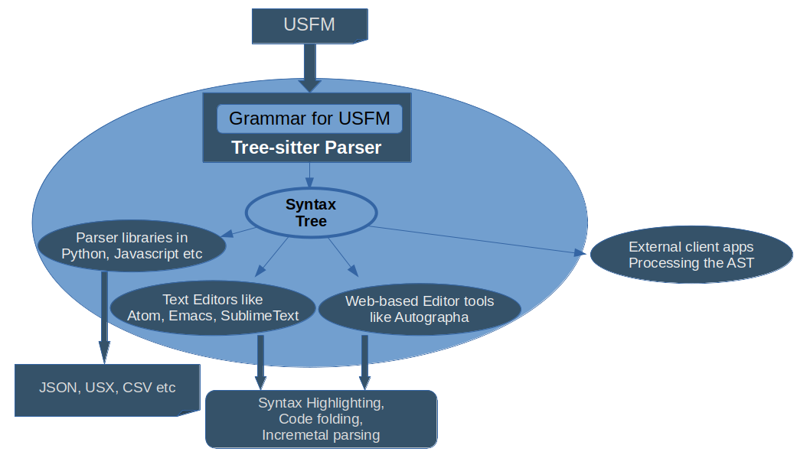
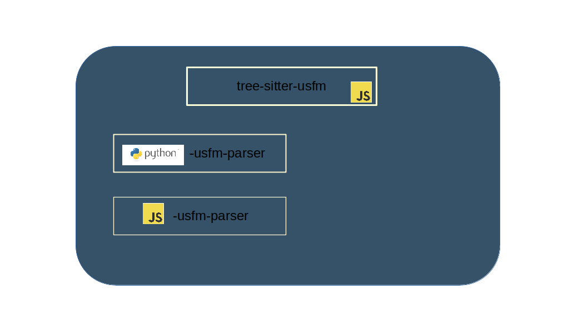

# Usfm-grammar Version 3
## Architecture

This document describes the high-level architecture of usfm-grammar. This is intended to guide you to familiarize yourself with the code base.

## Bird's Eye View


*context diagram*

Usfm-grammar is a grammar implementation, modelling the [USFM](https://github.com/ubsicap/usfm) markup language, popularly used to represent the scripture(Bible) and meta-scripturual contents. It also include parsers and editor-plugins built on top on this grammar to be able to convert USFM to other formats like JSON, CSV, USX(XML counter part of USFM) etc or be able to do syntax highlighting, code folding etc on editors.

Implemented Using
* Tree-sitter
* Python
* Javascript


*Container diagram*

## Code Map

This section talks briefly about various important directories and files. It would give you ideas on where to find things you are looking for, in the code base.

### usfm-grammar/tree-sitter-usfm

This module contain the grammar. Here we define and generate the grammar to be used by other modules and tools.
This module is published on npm indivdually as `tree-sitter-usfm`.

**grammar.js**: The file where we model the USFM language. Here we define the tokens, synatx rules and the structure of the output syntax-tree(AST).

**test/corpus**: This contain the test case. The test files start with `test` and should contain input USFM and expected AST. 


Useful commands while working in this module:
```
cd ./tree-sitter-usfm
export PATH=$PATH:./node_modules/.bin #to be able to use the CLI

tree-sitter generate #To re-generate the grammar after updation to grammar.js
tree-sitter test     # to run all test in test/corpus
tree-sitter test --update # to update all test files with the current output
```

### usfm-grammar/python-usfm-parser

This is a parser implemented to use the grammar to obtain syntax tree(AST) for a USFM file and then convert the AST to other formats via APIs(methods or CLI). This module has the python implementation of the parser and is published on pip.

**grammar_rebuild.py** : To be run upon any updations on the actual grammar implementation. This will create the python binding for the grammar at `../tree-sitter-usfm` and store them as `.so` file within this module. Then on, only this `.so` file is required to run the parser and it is not dependant on the outer module, `../tree-sitter-usfm`.

**usfm-grammar.py**: This is where the parser is implemented. It reads USFM, converts to AST, queries the AST, handles errors, converts specific contents of AST to other formats.

**IPython notebook**: This serves as the documentation on how to use the python library.


### usfm-grammar/javascript-usfm-parser

Just like the python-usfm-parser, this is a parser implemented to use the grammar to obtain syntax tree(AST) for a USFM file and then convert the AST to other formats via APIs(methods or CLI). This module has the javascript implementation of the parser and is published on npm (as usfm-grammar-3.x.x).

